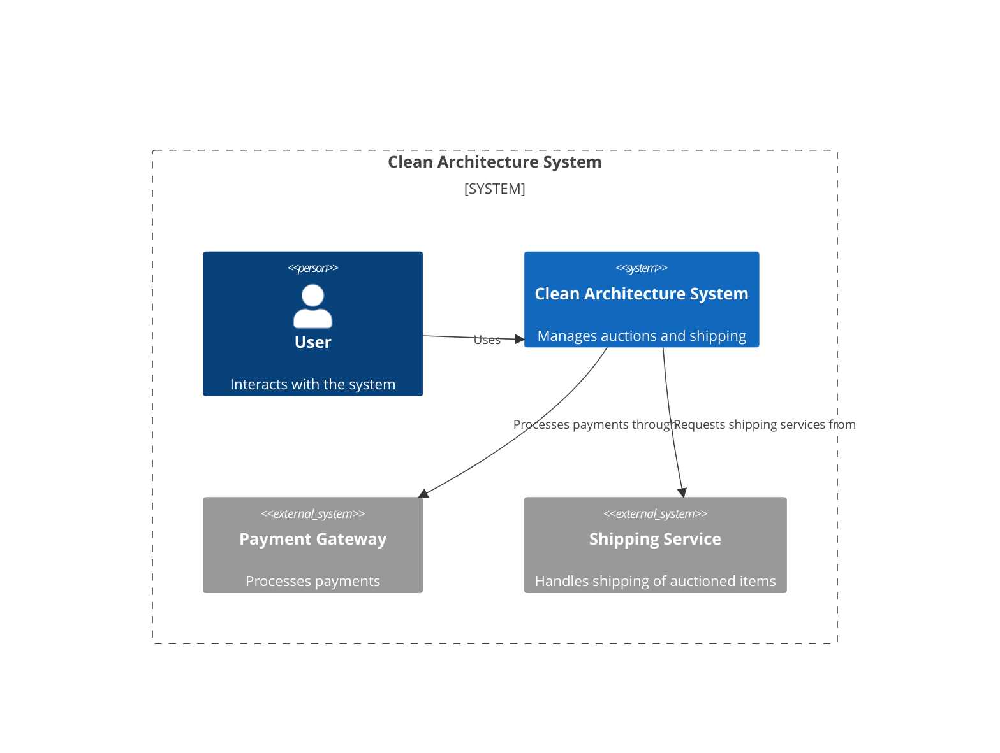
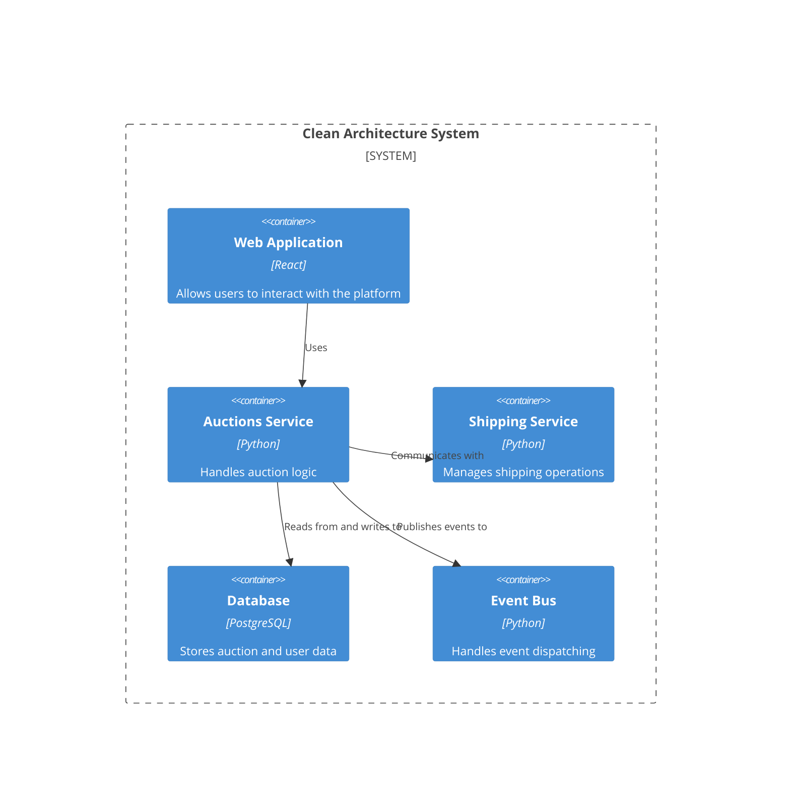
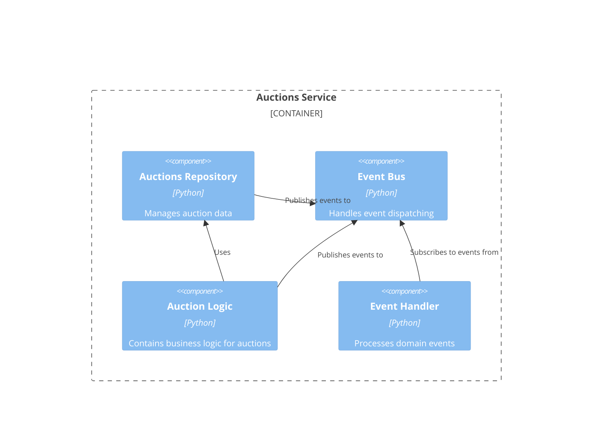

graph LR
  A[Start] --> B{Is it ok?}
  B -- Yes --> C[Great]
  B -- No --> D[Fix it]
# Архитектура проекта (C4)






```

# Документация проекта

# Overview

The repository implements a clean architecture system for managing auctions and shipping operations. It integrates with external payment and shipping services to facilitate the auctioning process, including bidding, auction management, and logistics.

## Key Objectives
- Manage auctions, including bidding, starting, and ending auctions.
- Handle shipping logistics for auctioned items.
- Integrate with payment gateways for processing payments.

# Установка

## Requirements
- Python 3.8+
- PostgreSQL
- Dependencies listed in `requirements.txt`

## Installation Steps
1. Clone the repository:
   ```bash
   git clone <repository-url>
   ```
2. Navigate to the project directory:
   ```bash
   cd clean-architecture
   ```
3. Install the dependencies:
   ```bash
   pip install -r requirements.txt
   ```
4. Set up the database:
   - Create a PostgreSQL database.
   - Apply migrations (if any).

# Быстрый старт

To quickly start the application, follow these steps:

1. Run the application:
   ```bash
   python manage.py runserver
   ```
2. Access the web application at `http://localhost:8000`.

# Архитектура

## Overview
The architecture follows a clean architecture pattern, separating concerns into different modules and layers.

### System Context


### Container Diagram


### Component Diagram


# API Reference

## Auctions Repository
- **Location**: `auctions/application/repositories/auctions.py`
- **Purpose**: Manages auction data.
- **Methods**:
  - `get(auction_id: AuctionId) -> Auction`: Retrieves an auction by its ID.
  - `save(auction: Auction) -> None`: Saves an auction.

## Address Repository
- **Location**: `shipping/application/repositories/address.py`
- **Purpose**: Manages address data.
- **Methods**:
  - `get(consignee_id: ConsigneeId) -> Address`: Retrieves an address by consignee ID.

# Примеры использования

### Example: Placing a Bid
```python
from auctions.application.use_cases import PlacingBid, PlacingBidInputDto

# Create input DTO
input_dto = PlacingBidInputDto(auction_id=1, bidder_id=2, amount=100)

# Execute use case
placing_bid = PlacingBid(boundary, repo)
placing_bid.execute(input_dto)
```

# FAQ

**Q: How do I set up the database?**
A: Create a PostgreSQL database and apply any necessary migrations.

**Q: How do I run the application?**
A: Use the command `python manage.py runserver` to start the application.

**Q: What are the main components of the system?**
A: The main components include the Auctions Service, Shipping Service, Web Application, Database, and Event Bus.
